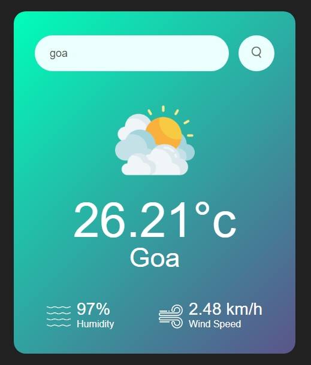

# 🌦️ Weather App 🌦️

A simple weather app built with JavaScript, HTML, and CSS that lets you check the current weather conditions for any city around the world.

## ⚙️ Features

- **Search for weather by city name:** Enter a city name and get instant weather information.
- **Clear and concise weather details:** View the temperature, humidity, wind speed, and a weather icon.
- **Error handling:**  Handles invalid city names and provides feedback to the user.

## 🌐 Demo

Check out the live demo: [https://your-github-pages-link-here.github.io/](https://gupta-ravi.github.io/JsWeatherApp/)

## 💻 Tutorial

[YouTube tutorial video](https://www.youtube.com/watch?v=MIYQR-Ybrn4)

## 🛠️ How it works

The app uses the OpenWeatherMap API to retrieve weather data. 

1. **User input:** The user enters a city name in the search bar.
2. **API call:** The app makes a request to the OpenWeatherMap API using the entered city name.
3. **Data processing:** The API response is processed and displayed in a user-friendly format.
4. **Visual representation:** The weather information is displayed on the screen, including the temperature, humidity, wind speed, and a weather icon.

## 💾 Installation

1. Clone the repository: `git clone https://github.com/your-github-username/JsWeatherApp.git`
2. Open the `index.html` file in your web browser.

## 🔧 Technologies Used

- **HTML:** Structural foundation of the app.
- **CSS:** Styling the user interface.
- **JavaScript:** Handling user interaction, API requests, and data manipulation.

## 🤝 Contributing

Contributions are welcome! If you find any bugs or have suggestions for improvements, please submit a pull request.

## 📜 License

This project is licensed under the MIT License.

## 🖼️ Screenshot

 
